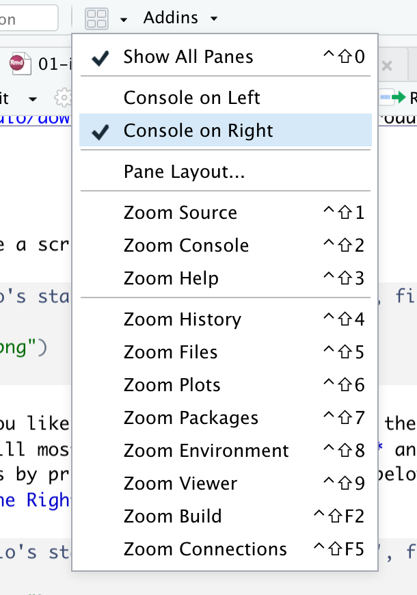

# Getting Started

R is an **free** software for statistics and graphics. It is widely used among statisticians and data scientists for developing statistical software and data analysis.     


R is primarily developed in three programming languages: C, Fortan and R itself. Although It itself can be used with command line interface, there are several third-party integrated development environment (IDE) with nice graphical user interface, including RStudio and Jupyter Notebook.    

R comes from `S` programming language. `S` was created by [John Chambers](https://en.wikipedia.org/wiki/John_Chambers_(programmer)) in 1976 at Bell Labs. Later, two statisticians, Ross Ihaka and Robert Gentleman, developed R that is currently maintained by the R Development Core Team. R is named partly after the first names of the first two R authors and partly as a play on the name of S.    


R can be downloaded from [http://cran.r-project.org/](http://cran.r-project.org/).   

## RStudio

`Rstudio` is an integraded environment for R. It comes in two versions: Desktop version is a desktop application and server version runs on a web browser. Regular `RStudio` for personal usage is free for both desktop and server version.    

> If R is a car engine, then RStudio is the structure of that care, body frame, interior design and every other thing that help us operate it safely, efficiently and comfotably.

RStudio can be downloaded from [their official website](https://rstudio.com/products/rstudio/download). 

## Start screen 

When you open RStudio, you will see a screen that looks like figure \@ref(fig:startscreen).

```{r startscreen, echo=FALSE, fig.cap="RStudio's start screen", out.width = '100%'}
knitr::include_graphics("img/rstudio_interface.png")
```

The interface has four window panes. Each window pane may have several tabs or sub-windows. By default, **Source Pane** is on the top-left corner, **Console Pane** on bottom-left, **Environment Pane** on top-right, and **Files Pane** on bottom-right.

1. **Source Pane** is a text editor that will be referred to as *R Script* later on. You can write commands and save them, which is the main point of reproducibility. Anyone who has this R Script can review and edit it in the future.
2. **Console Pane** is the place you write your line-by-line command. It means you can only write a single command or a long paragraph of commands. After you close the RStudio, the commands will not be saved unless you specified to do so. However, it is the best way to saving **R Script** in **Source Pane**to store the commands you desire.

    * Symbol `>` called prompt
    * Type 3 + 4, and press Enter.

3. **Environment Pane** has several sub-windows. For data management and beginner, you only have to know Environment and History.

    * `Environment` is where R works.
    * `Global Environment` is the place where your data will be after importing data.
    * `History` saves the commands you run in R console.
    * `Connections` is where you connect to external databases.

4. **Files Pane** also has several sub-windows.

    * `Files` is like a folder manager on your phone. You can manage files and folders as well as set the working directory.
    * `Plots` is where your plots will appear.
    * `Packages` is where you manage your R packages. You can install it from CRAN or other repositories. You can also install locally stored R packages.
    * `Help` is where R stores documentations. You can open the help or introduction page of the respective packages as well as individual functions.

You can arrange these windows as you like. I think putting console on the right upper window will give you a lot of freedom as you will mostly be using **Source Pane** and **Console Pane** simultaneously. You can change this by pressing the four window icon below the menu bar and choosing the option **Console on the Right** as shown in figure \@ref(fig:consoleright). 

```{r consoleright, echo=FALSE, fig.cap="Changing console to the right upper window", out.width = '50%', fig.align='center'}

```

## R Packages 

`Base R` is what you get after installing R. R is powerful because of its tens of thousands of packages. The number is still growing. This also creates the problem of confusion. Even no single user can check or use all packages R can offer. A solution is to stick to certain packages that work well for you. In this book, I will show you a few packages that works for me.

### Installing a package from CRAN

To install a package, you can use the function `install.packages("package_name")` if it is published on `CRAN`. `CRAN` is the comprehensive R Archive Network, web servers that store R packages. 

Packages installed directly from Github are usually under development, but up-to-date and often free from previous issues and bugs.

Let's install the packages used in this book.

```{r eval=FALSE}
package_name <- c("tidyverse", "mStats", "flextable")
install.packages(package_name)
```


### Installing a package from GitHub 

For packages published on GitHub, use either `devtools::install_github("repo")` or `remotes::install_github("repo")`. 

Let's illustrate this by installing `remotes` and then `mStats` from GitHub.

```{r eval=FALSE}
install.packages("remotes")
remotes::install_github("myominnoo/mStats")
```

### Essential packages for this book

* dplyr
* mStats
* magrittr 

## mStats

R has a steep learning curve. For physicians and health professionals, they just want to get started with data management and analysis, rather than spending a lot of time to learn and master R. There might be an advantage to mastering R; however unlike statisticians and programmers, it seems a very daunting process for them to become comfortable with coding in R. 

The `mStats` package was developed to facilitate the data management and analysis in R while requiring only a few basic of R. It takes some principles from one of the most popular statistical software in public health settings, `STATA`. `STATA` has been in existence for a long time now that most of its commands are stable, powerful, and intuitive. These features attract power-users and help them accomplish their data tasks. 

In a nutshell, `mStats` is a R package that facilitates data management and analysis of health research in R environment. It includes three core sets of functions that are designed to help data management, data analysis, and reporting streamline for health research projects. 

For epidemiology and public health, there are already a number of good packages available for `R`, including but not limited to `epiCalc`, `Epi`, `epibasix`, `epiDisplay`, `epiR` and `epitools`. `mStats` does not intend to replace any of them, but to only contribute as much as I can to data management and analysis of health research projects.

### How it started
The `mStats` package came into life when I started my doctoral life in Thailand in 2018. The first version of `mStats` was released in late 2018. Initially it was intended to prove a concept of what I have learnt and how much I could make use of what I have learnt so far. In addition, I would like something open source unlike `STATA` and something different from base R. 

There are two packages that deeply inspired me to do this: `dplyr` under the universe of `tidyverse` by **Hadley Wickham** and `epiCalc` by my advisor **Virasakdi Chongsuvivatwong**. The first version of `mStats` made use of `ggplot2` and included functions for generating ready-made plots. I released several small patch versions with addition of a few functions that were interesting to me at that time.

In mid 2019, I started another package called `stats2`. In this package, I tried to simplify the concept of one function doing one task with a few or no options to tweak the task. Although this might be in contrast with the generous flexibility of `R`, I hardly doubt beginners would mind this limitation. In fact, such simplicity might make users' life easier to get their jobs in R done. The package was on CRAN and released on March 31, 2020.

As times progress, I hope this package will find its way to some people in their works.

### Guiding principles 

Most of the guiding principles behind `dplyr`, `tidyverse`, and `STATA` inspire the creation and development of the `mStats` package: 

* **Compose simple functions with the pipe**: 
    
    * `data masking` for tidy evaluation: it is very common to use datasets as in the form of `data frame` in as R analysis project. `R` functions are mostly very generic and created for basic data structures of R. The [tidyverse] uses tidy evaluation and implements data masking in its `dplyr` package. This allows manipulation of **data-variables** as if they were "programming" variables that live in an environment. Basically, it allows you to type, as an example, `generate(airquality, lnOzone = log(Ozone))` instead of `airquality$lnOzone <-  log(airquality$Ozone)`.  
    
    * The principle of pipes changes the paradigm of coding in `R`. The use of the pipe function `%>%` from the  `magrittr` package allows for cleaner code and enhances readability of the codes. Most functions in `mStats` is compatible with the usage of the pipe function. 
    
* **Designed for humans**: 

    * `KISS`: Keep `functions` short and simple - one function does only one task with few options to change the nature of the task. `mStats` intentionally limits options of arguments in functions and attempts to balance between having too many argument options and having no options at all. 
    
    * `Labels`: `mStats` consistently uses the concept of **labelling variables and datasets**. It also streamlines `labels` for the purpose of report generation. Though it is not necessary to label values, this can be done using certain packages like `labelled` and `sjlabelled`.
    
    * Outputs: outputs in the console are well-formatted for the ease of interpretation. 
    
* **Reproducible research**

    * Making tables is One of the most common tasks in health research analysis where most researchers waste much time. Reproducibility in health research is becoming crucially important and depends on streamlining this process. `mStats` provides one of many workflows used for tables generation and link to `R` codes for getting the job done.    

## Package masking 
Packages including `mStats` might contain functions that are in conflicts with other packages. I suggest to explicitly use the syntax to call the desired package, `package::function`. 

For example, the `cut` function from `mStats` will be masked from the `cut` function from `base`. When you want to use the function from base, you need to write this: `base::cut()`. 

## Piping your workflow

The pipe function `%>%` from the `magrittr` package can connect several lines of codes in a single workflow. It allows cleaner codes and enhances human readability. As an example, if you have three generic functions, you can write codes like this: `function3(function32(function31(..., data), ...), ...)`. But it is confusing. By using `%>%`, we can arrange codes from top to bottom and left to right as follow: 

```{r, eval=FALSE}
data %>%
  function1(...) %>% 
  function2(...) %>% 
  function3(...)
```

## Searching Help

### General

If you get stuck, try to google it or search on virtual forums like `Stack Overflow`. Most of what you want to know are already answered or solved in one of those forums.  

### Getting help

If you encounter a clear bug, please file an issue with a minimal
reproducible example on
[GitHub](https://github.com/myominnoo/mStats/issues). For questions and
other discussion, please directly email me [dr.myominnoo@gmail.com](mailto::dr.myominnoo@gmail.com) or use the [mStats mailing list](https://groups.google.com/g/mstats).

## Example datasets {#exampledata}

In this book, we will use datasets from several sources. The code chunks below download these datasets into a `data` folder under your current working directory. 

Let's create a function that takes a URL link for zipped files, download, and unzip the files into specified directory. 

```{r eval= FALSE}
download_zipfile <- function(url, exdir = "data/", file = tempfile(), junkpaths = TRUE) {
    for (link in url) {
        ## download the dmus2 zipped file into temporary file
        download.file(link, file)
        
        ## extract the dmus2 datasets into the data folder
        unzip(file, exdir = exdir, junkpaths = TRUE)
    }
}
```

### dmus2 

The following code chunk downloads datasets from one of the most popular data management books for Stata, [Data Management Using Stata: A Practical Handbook, Second Edition](https://www.stata-press.com/data/dmus2.html)

```{r eval=FALSE}
## Download dmus2 zipped file
download_zipfile("https://www.stata-press.com/data/dmus2/dmus2.zip", 
                 exdir = "data/dmus2")
```

### WHO Mortality Data

THe following code chunks download datasets from [WHO webpage](https://www.who.int/data/data-collection-tools/who-mortality-database). 

```{r eval=FALSE}
## 1. A list of countries-years available for the mortality and population data.
## 2. Reference populations and live births.
## 3. Country codes
file <- c("https://cdn.who.int/media/docs/default-source/world-health-data-platform/mortality-raw-data/mort_availability.zip?sfvrsn=23261e11_15&ua=1", 
          "https://cdn.who.int/media/docs/default-source/world-health-data-platform/mortality-raw-data/mort_pop.zip?sfvrsn=937039fc_10&ua=1", 
          "https://cdn.who.int/media/docs/default-source/world-health-data-platform/mortality-raw-data/mort_country_codes.zip?sfvrsn=800faac2_5&ua=1")
download_zipfile(file, exdir = "data/who")
```

### UCLA Stata Tutorial

The following code chunks download datasets from [UCLA's Stata tutorials](). 

```{r eval=FALSE}
if (!dir.exists("data/ucla")) 
    dir.create("data/ucla") ## this will create a directory if it's not there

download.file("http://stats.idre.ucla.edu/stat/data/patient_pt1_stata_dm.dta", 
              destfile = "data/ucla/patient_pt1_stata_dm.dta")
download.file("http://stats.idre.ucla.edu/stat/data/patient_pt2_stata_dm.dta", 
              destfile = "data/ucla/patient_pt2_stata_dm.dta")
download.file("http://stats.idre.ucla.edu/stat/data/doctor_stata_dm.dta", 
              destfile = "data/ucla/doctor_stata_dm.dta")

download.file("http://stats.idre.ucla.edu/stat/data/hsb2.csv", 
              destfile = "data/ucla/hsb2.csv")
download.file("http://stats.idre.ucla.edu/stat/data/hsb2.xls", 
              destfile = "data/ucla/hsb2.xls")
```

### Miliary Tuberculosis

The following dataset was used to evaluated a scoring system for central nervous tuberculosis among patients with miliary tuberculosis in a Chinese hospital. Read their study [here](https://journals.plos.org/plosone/article?id=10.1371/journal.pone.0176651).

We put this dataset into a separate path `data/others/`. 

```{r eval=FALSE}
if (!dir.exists("data/others")) 
    dir.create("data/others") ## this will create a directory if it's not there

download.file("https://journals.plos.org/plosone/article/file?type=supplementary&id=info:doi/10.1371/journal.pone.0176651.s001", 
              destfile = "data/others/miliary_tb.xlsx")
```